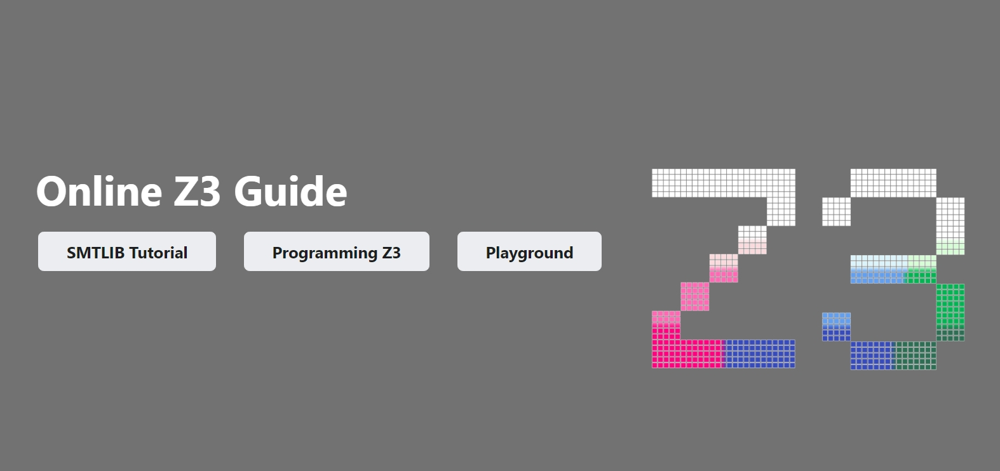

# BooledASS: GPU-Accelerated SAT & QF_BV SMT Solver

BooledASS is a high-performance theorem prover and SAT solver optimized for QF_BV (Quantifier-Free Bit-Vectors) logic benchmarks. It integrates the BooledASS GPU BCP (Boolean Constraint Propagation) engine and features advanced CPU-level bit-blasting and internalization optimizations.

## BooledASS QF_BV Solver Optimizations

The solver optimizes standard CPU-level QF_BV solving with the following bit-blasting and internalization improvements:

1. **Symmetrical Joint Full-Adder Internalization (`bv_internalize.cpp`)**: Jointly maps sum (`OP_XOR3`) and carry-out (`OP_CARRY`) to a minimal 10-clause cover instead of internalizing them independently (saving 4 clauses, or **28.5%** per full-adder).
2. **Shared Carry-Out Gate via ITE (`bit_blaster_rewriter.cpp`)**: Rewrites standard carry-out to use $Cout = \text{ITE}(\text{XOR}(A, B), C, A)$, sharing the already computed and cached $XOR(A, B)$ term, reducing carry-out encoding from 13 clauses to 4 clauses.

### SMT-COMP QF_BV Benchmark Results (CPU-Only Mode)

Evaluating these CPU-only internalization and bit-blasting optimizations against Baseline Z3 across the 10 SMT-COMP QF_BV benchmarks yields the following comparative results:

| Benchmark | Logic / Status | Metric | Baseline Z3 | BooledASS | Change / Speedup |
| :--- | :--- | :--- | :---: | :---: | :---: |
| **test_qfbv.smt2** | SAT | SAT Variables | 38 | 38 | **0.0%** |
| | | Total SAT Clauses | 105 | 105 | **0.0%** |
| | | SAT Conflicts | 5 | 5 | **0.0%** |
| | | Solving Time | 0.01s | 0.01s | **N/A (<0.02s)** |
|--- |--- |--- |--- |--- |--- |
| **test_qfbv_hard.smt2** | UNSAT | SAT Variables | 1 | 1 | **0.0%** |
| | | Total SAT Clauses | 0 | 0 | **0.0%** |
| | | SAT Conflicts | 0 | 0 | **0.0%** |
| | | Solving Time | 0.00s | 0.00s | **N/A (<0.02s)** |
|--- |--- |--- |--- |--- |--- |
| **bench_qfbv_mult16.smt2** | SAT | SAT Variables | 2,305 | 1,738 | **-24.6%** |
| | | Total SAT Clauses | 7,865 | 7,067 | **-10.1%** |
| | | SAT Conflicts | 26 | 61 | **+134.6%** |
| | | Solving Time | 0.01s | 0.01s | **N/A (<0.02s)** |
|--- |--- |--- |--- |--- |--- |
| **bench_qfbv_mult32.smt2** | SAT | SAT Variables | 9,838 | 7,180 | **-27.0%** |
| | | Total SAT Clauses | 59,103 | 29,805 | **-49.6%** |
| | | SAT Conflicts | 168 | 115 | **-31.5%** |
| | | Solving Time | 0.07s | 0.02s | **N/A (<0.02s)** |
|--- |--- |--- |--- |--- |--- |
| **bench_qfbv_mult64.smt2** | SAT | SAT Variables | 40,646 | 29,204 | **-28.2%** |
| | | Total SAT Clauses | 247,468 | 218,407 | **-11.7%** |
| | | SAT Conflicts | 877 | 2,479 | **+182.7%** |
| | | Solving Time | 0.31s | 0.35s | **-12.9%** |
|--- |--- |--- |--- |--- |--- |
| **bench_comm_96.smt2** | UNSAT | SAT Variables | 1 | 1 | **0.0%** |
| | | Total SAT Clauses | 0 | 0 | **0.0%** |
| | | SAT Conflicts | 0 | 0 | **0.0%** |
| | | Solving Time | 0.00s | 0.00s | **N/A (<0.02s)** |
|--- |--- |--- |--- |--- |--- |
| **bench_dist_96.smt2** | UNSAT | SAT Variables | 1 | 1 | **0.0%** |
| | | Total SAT Clauses | 0 | 0 | **0.0%** |
| | | SAT Conflicts | 0 | 0 | **0.0%** |
| | | Solving Time | 0.00s | 0.00s | **N/A (<0.02s)** |
|--- |--- |--- |--- |--- |--- |
| **test_crypto.smt2** | SAT | SAT Variables | 7,720 | 5,305 | **-31.3%** |
| | | Total SAT Clauses | 168,980 | 64,703 | **-61.7%** |
| | | SAT Conflicts | 114,046 | 20,687 | **-81.9%** |
| | | Solving Time | 8.29s | 1.54s | **+81.4% Speedup** |
|--- |--- |--- |--- |--- |--- |
| **bench_factor64.smt2** | UNSAT | SAT Variables | 8,116 | 6,213 | **-23.4%** |
| | | Total SAT Clauses | 62,631 | 52,569 | **-16.1%** |
| | | SAT Conflicts | 15,529 | 11,388 | **-26.7%** |
| | | Solving Time | 0.96s | 0.56s | **+41.7% Speedup** |
|--- |--- |--- |--- |--- |--- |
| **bench_wrap_128.smt2** | SAT | SAT Variables | 56,269 | 40,519 | **-28.0%** |
| | | Total SAT Clauses | 340,782 | 296,016 | **-13.1%** |
| | | SAT Conflicts | 2,161 | 1,302 | **-39.8%** |
| | | Solving Time | 0.47s | 0.34s | **+27.7% Speedup** |
|--- |--- |--- |--- |--- |--- |

## GPU-Accelerated SAT Solving

For extremely large formula sizes, BooledASS automatically switches to offloading parallel unit propagation (BCP) to the GPU via CUDA.
- **Default threshold**: 200,000 clauses.
- **Runtime override**: Set the `Z3_GPU_THRESHOLD` environment variable (e.g., `$env:Z3_GPU_THRESHOLD=1000000`).

### Cryptographic ARX Mixing Round Benchmarks

On massive cryptographic ARX (Addition-Rotation-XOR) mixing instances—which are notoriously difficult for standard CPU solvers due to the dense data dependencies—the GPU-accelerated propagation engine begins outperforming the CPU solver once the setup and data transfer overhead is amortized:

| Benchmark (ARX Mixing) | Clauses | Conflicts | CPU Time (Normal Z3) | GPU Time (BooledASS) | Speedup |
| :--- | :--- | :--- | :--- | :--- | :--- |
| **Small (Breakeven)** | 312,474 | 100,000 | 25.02s | 26.60s | -6.3% |
| **Medium** | 624,235 | 100,000 | 67.28s | 61.89s | **+8.0% Speedup** |
| **Large** | 1,248,376 | 200,000 | 520.43s | 500.46s | **+3.8% Speedup** |

---

## About Z3 (Base Solver)

BooledASS is built on top of Microsoft Research's Z3 theorem prover. 
It is licensed under the [MIT license](LICENSE.txt). Windows binary distributions include [C++ runtime redistributables](https://visualstudio.microsoft.com/license-terms/vs2022-cruntime/)

If you are not familiar with Z3, you can start [here](https://github.com/Z3Prover/z3/wiki#background).

Pre-built binaries for stable and nightly releases are available [here](https://github.com/Z3Prover/z3/releases).

Z3 can be built using [Visual Studio][1], a [Makefile][2], using [CMake][3],
using [vcpkg][4], or using [Bazel][5].
It provides [bindings for several programming languages][6].

See the [release notes](RELEASE_NOTES.md) for notes on various stable releases of Z3.

[](https://microsoft.github.io/z3guide/)

## Build status

### Pull Request & Push Workflows
| WASM Build | Windows Build | CI | OCaml Binding |
| ------------|---------------|----|-----------| 
| [](https://github.com/Z3Prover/z3/actions/workflows/wasm.yml) | [](https://github.com/Z3Prover/z3/actions/workflows/Windows.yml) | [](https://github.com/Z3Prover/z3/actions/workflows/ci.yml) | [](https://github.com/Z3Prover/z3/actions/workflows/ocaml.yaml) |

### Scheduled Workflows
| Open Bugs | Android Build | Pyodide Build | Nightly Build | Cross Build |
| -----------|---------------|---------------|---------------|-------------|
| [](https://github.com/Z3Prover/z3/actions/workflows/wip.yml) | [](https://github.com/Z3Prover/z3/actions/workflows/android-build.yml) | [](https://github.com/Z3Prover/z3/actions/workflows/pyodide.yml) | [](https://github.com/Z3Prover/z3/actions/workflows/nightly.yml) | [](https://github.com/Z3Prover/z3/actions/workflows/cross-build.yml) |

| MSVC Static | MSVC Clang-CL | Build Z3 Cache | Code Coverage | Memory Safety | Mark PRs Ready |
|-------------|---------------|----------------|---------------|---------------|----------------|
| [](https://github.com/Z3Prover/z3/actions/workflows/msvc-static-build.yml) | [](https://github.com/Z3Prover/z3/actions/workflows/msvc-static-build-clang-cl.yml) | [](https://github.com/Z3Prover/z3/actions/workflows/build-z3-cache.yml) | [](https://github.com/Z3Prover/z3/actions/workflows/coverage.yml) | [](https://github.com/Z3Prover/z3/actions/workflows/memory-safety.yml) | [](https://github.com/Z3Prover/z3/actions/workflows/mark-prs-ready-for-review.yml) |

### Manual & Release Workflows
| Documentation | Release Build | WASM Release | NuGet Build |
|---------------|---------------|--------------|-------------|
| [](https://github.com/Z3Prover/z3/actions/workflows/docs.yml) | [](https://github.com/Z3Prover/z3/actions/workflows/release.yml) | [](https://github.com/Z3Prover/z3/actions/workflows/wasm-release.yml) | [](https://github.com/Z3Prover/z3/actions/workflows/nuget-build.yml) |

### Specialized Workflows
| Nightly Validation | Copilot Setup | Agentics Maintenance |
|--------------------|---------------|----------------------|
| [](https://github.com/Z3Prover/z3/actions/workflows/nightly-validation.yml) | [](https://github.com/Z3Prover/z3/actions/workflows/copilot-setup-steps.yml) | [](https://github.com/Z3Prover/z3/actions/workflows/agentics-maintenance.yml) |

### Agentic Workflows
| A3 Python | API Coherence | Code Simplifier | Release Notes | Workflow Suggestion |
| ----------|---------------|-----------------|---------------|---------------------|
| [](https://github.com/Z3Prover/z3/actions/workflows/a3-python.lock.yml) | [](https://github.com/Z3Prover/z3/actions/workflows/api-coherence-checker.lock.yml) | [](https://github.com/Z3Prover/z3/actions/workflows/code-simplifier.lock.yml) | [](https://github.com/Z3Prover/z3/actions/workflows/release-notes-updater.lock.yml) | [](https://github.com/Z3Prover/z3/actions/workflows/workflow-suggestion-agent.lock.yml) |

| Academic Citation | Build Warning Fixer | Code Conventions | CSA Report | Issue Backlog |
| ------------------|---------------------|------------------|------------|---------------|
| [](https://github.com/Z3Prover/z3/actions/workflows/academic-citation-tracker.lock.yml) | [](https://github.com/Z3Prover/z3/actions/workflows/build-warning-fixer.lock.yml) | [](https://github.com/Z3Prover/z3/actions/workflows/code-conventions-analyzer.lock.yml) | [](https://github.com/Z3Prover/z3/actions/workflows/csa-analysis.lock.yml) | [](https://github.com/Z3Prover/z3/actions/workflows/issue-backlog-processor.lock.yml) |

| Memory Safety Report | Ostrich Benchmark | QF-S Benchmark | Tactic-to-Simplifier | ZIPT Code Reviewer |
| ---------------------|-------------------|----------------|----------------------|--------------------|
| [](https://github.com/Z3Prover/z3/actions/workflows/memory-safety-report.lock.yml) | [](https://github.com/Z3Prover/z3/actions/workflows/ostrich-benchmark.lock.yml) | [](https://github.com/Z3Prover/z3/actions/workflows/qf-s-benchmark.lock.yml) | [](https://github.com/Z3Prover/z3/actions/workflows/tactic-to-simplifier.lock.yml) | [](https://github.com/Z3Prover/z3/actions/workflows/zipt-code-reviewer.lock.yml) |

[1]: #building-z3-on-windows-using-visual-studio-command-prompt
[2]: #building-z3-using-make-and-gccclang
[3]: #building-z3-using-cmake
[4]: #building-z3-using-vcpkg
[5]: #building-z3-using-bazel
[6]: #z3-bindings

## Building Z3 on Windows using Visual Studio Command Prompt

For 32-bit builds, start with:

```bash
python scripts/mk_make.py
```

or instead, for a 64-bit build:

```bash
python scripts/mk_make.py -x
```

then run:

```bash
cd build
nmake
```

Z3 uses C++20. The recommended version of Visual Studio is therefore VS2019 or later.

**Security Features (MSVC)**: When building with Visual Studio/MSVC, a couple of security features are enabled by default for Z3:
- Control Flow Guard (`/guard:cf`) - enabled by default to detect attempts to compromise your code by preventing calls to locations other than function entry points, making it more difficult for attackers to execute arbitrary code through control flow redirection
- Address Space Layout Randomization (`/DYNAMICBASE`) - enabled by default for memory layout randomization, required by the `/GUARD:CF` linker option
- These can be disabled using `python scripts/mk_make.py --no-guardcf` (Python build) or `cmake -DZ3_ENABLE_CFG=OFF` (CMake build) if needed

## Building Z3 using make and GCC/Clang

Execute:

```bash
python scripts/mk_make.py
cd build
make
sudo make install
```

Note by default ``g++`` is used as C++ compiler if it is available. If you
prefer to use Clang, change the ``mk_make.py`` invocation to:

```bash
CXX=clang++ CC=clang python scripts/mk_make.py
```

Note that Clang < 3.7 does not support OpenMP.

You can also build Z3 for Windows using Cygwin and the Mingw-w64 cross-compiler.
In that case, make sure to use Cygwin's own Python and not some Windows installation of Python.

For a 64-bit build (from Cygwin64), configure Z3's sources with
```bash
CXX=x86_64-w64-mingw32-g++ CC=x86_64-w64-mingw32-gcc AR=x86_64-w64-mingw32-ar python scripts/mk_make.py
```
A 32-bit build should work similarly (but is untested); the same is true for 32/64 bit builds from within Cygwin32.

By default, it will install z3 executables at ``PREFIX/bin``, libraries at
``PREFIX/lib``, and include files at ``PREFIX/include``, where the ``PREFIX``
installation prefix is inferred by the ``mk_make.py`` script. It is usually
``/usr`` for most Linux distros, and ``/usr/local`` for FreeBSD and macOS. Use
the ``--prefix=`` command-line option to change the install prefix. For example:

```bash
python scripts/mk_make.py --prefix=/home/leo
cd build
make
make install
```

To uninstall Z3, use

```bash
sudo make uninstall
```

To clean Z3, you can delete the build directory and run the ``mk_make.py`` script again.

## Building Z3 using CMake

Z3 has a build system using CMake. Read the [README-CMake.md](README-CMake.md)
file for details. It is recommended for most build tasks, 
except for building OCaml bindings.

## Building Z3 using vcpkg

vcpkg is a full platform package manager. To install Z3 with vcpkg, execute:

```bash
git clone https://github.com/microsoft/vcpkg.git
./bootstrap-vcpkg.bat # For powershell
./bootstrap-vcpkg.sh # For bash
./vcpkg install z3
```

## Building Z3 using Bazel

Z3 can be built using [Bazel](https://bazel.build/). This is known to work on
Ubuntu with Clang (but may work elsewhere with other compilers):
```
bazel build //...
```

## Dependencies

Z3 itself has only few dependencies. It uses C++ runtime libraries, including pthreads for multi-threading.
It is optionally possible to use GMP for multi-precision integers, but Z3 contains its own self-contained 
multi-precision functionality. Python is required to build Z3. Building Java, .NET, OCaml and 
Julia APIs requires installing relevant toolchains.

## Z3 bindings

Z3 has bindings for various programming languages.

### ``.NET``

You can install a NuGet package for the latest release Z3 from [nuget.org](https://www.nuget.org/packages/Microsoft.Z3/).

Use the ``--dotnet`` command line flag with ``mk_make.py`` to enable building these.

See [``examples/dotnet``](examples/dotnet) for examples.

### ``C``

These are always enabled.

See [``examples/c``](examples/c) for examples.

### ``C++``

These are always enabled.

See [``examples/c++``](examples/c++) for examples.

### ``Java``

Use the ``--java`` command line flag with ``mk_make.py`` to enable building these.

For IDE setup instructions (Eclipse, IntelliJ IDEA, Visual Studio Code) and troubleshooting, see the [Java IDE Setup Guide](doc/JAVA_IDE_SETUP.md).

See [``examples/java``](examples/java) for examples.

### ``Go``

Use the ``--go`` command line flag with ``mk_make.py`` to enable building these. Note that Go bindings use CGO and require a Go toolchain (Go 1.20 or later) to build.

With CMake, use the ``-DZ3_BUILD_GO_BINDINGS=ON`` option.

See [``examples/go``](examples/go) for examples and [``src/api/go/README.md``](src/api/go/README.md) for complete API documentation.

### ``OCaml``

Use the ``--ml`` command line flag with ``mk_make.py`` to enable building these.

See [``examples/ml``](examples/ml) for examples.

### ``Python``

You can install the Python wrapper for Z3 for the latest release from pypi using the command:

```bash
   pip install z3-solver
```

Use the ``--python`` command line flag with ``mk_make.py`` to enable building these.

Note that it is required on certain platforms that the Python package directory
(``site-packages`` on most distributions and ``dist-packages`` on Debian-based
distributions) live under the install prefix. If you use a non-standard prefix
you can use the ``--pypkgdir`` option to change the Python package directory
used for installation. For example:

```bash
python scripts/mk_make.py --prefix=/home/leo --python --pypkgdir=/home/leo/lib/python-2.7/site-packages
```

If you do need to install to a non-standard prefix, a better approach is to use
a [Python virtual environment](https://virtualenv.readthedocs.org/en/latest/)
and install Z3 there. Python packages also work for Python3.
Under Windows, recall to build inside the Visual C++ native command build environment.
Note that the ``build/python/z3`` directory should be accessible from where Python is used with Z3 
and it requires ``libz3.dll`` to be in the path.

```bash
virtualenv venv
source venv/bin/activate
python scripts/mk_make.py --python
cd build
make
make install
# You will find Z3 and the Python bindings installed in the virtual environment
venv/bin/z3 -h
...
python -c 'import z3; print(z3.get_version_string())'
...
```

See [``examples/python``](examples/python) for examples.

### ``Julia``

The Julia package [Z3.jl](https://github.com/ahumenberger/Z3.jl) wraps the C API of Z3. A previous version of it wrapped the C++ API: Information about updating and building the Julia bindings can be found in [src/api/julia](src/api/julia).

### ``WebAssembly`` / ``TypeScript`` / ``JavaScript``

A WebAssembly build with associated TypeScript typings is published on npm as [z3-solver](https://www.npmjs.com/package/z3-solver). Information about building these bindings can be found in [src/api/js](src/api/js).

### Smalltalk (``Pharo`` / ``Smalltalk/X``)

Project [MachineArithmetic](https://github.com/shingarov/MachineArithmetic) provides a Smalltalk interface
to Z3's C API. For more information, see [MachineArithmetic/README.md](https://github.com/shingarov/MachineArithmetic/blob/pure-z3/MachineArithmetic/README.md).

### AIX

[Build settings for AIX are described here.](https://github.com/Z3Prover/z3/pull/8113)

## System Overview


## Interfaces

* Default input format is [SMTLIB2](http://smtlib.cs.uiowa.edu)

* Other native foreign function interfaces:
* [C++ API](https://z3prover.github.io/api/html/namespacez3.html)
* [.NET API](https://z3prover.github.io/api/html/namespace_microsoft_1_1_z3.html)
* [Java API](https://z3prover.github.io/api/html/namespacecom_1_1microsoft_1_1z3.html)
* [Python API](https://z3prover.github.io/api/html/namespacez3py.html) (also available in [pydoc format](https://z3prover.github.io/api/html/z3.html))
* [Rust](https://github.com/prove-rs/z3.rs)
* C
* OCaml
* [Julia](https://github.com/ahumenberger/Z3.jl)
* [Smalltalk](https://github.com/shingarov/MachineArithmetic/blob/pure-z3/MachineArithmetic/README.md) (supports Pharo and Smalltalk/X)

## Power Tools
* The [Axiom Profiler](https://github.com/viperproject/axiom-profiler-2) currently developed by ETH Zurich

